# When Transactions Go Wrong: Learning from Distributed System Failures

**Understanding why simple database transactions aren't enough and exploring different approaches to distributed consistency**

Every developer has faced the nightmare: the database says 'yes,' the payment API says 'no,' and the customer says 'angry.'

_If you've ever dealt with a customer charged twice or an order saved without payment, you know the nightmare of distributed failures. Building reliable systems with microservices means confronting a harsh truth: simple database transactions aren't enough. This guide breaks down why our foundational consistency tools fail at scale and explores the essential architectural patterns - from SAGA to Idempotency - that global, fault-tolerant systems rely on._

## 💥 The Black Friday Nightmare: When Distributed Systems Fail

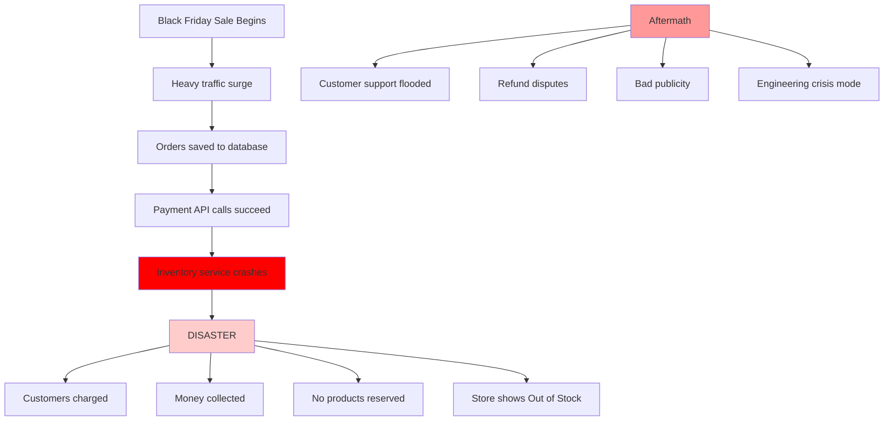

**What went wrong?** *(Similar patterns seen at many e-commerce companies)*
- ✅ Database transactions worked perfectly (orders saved)
- ✅ Payment gateway processed charges successfully  
- ❌ Inventory service couldn't handle the load and crashed
- ❌ No coordination between systems
- ❌ No rollback mechanism for external payments

**Real examples from the industry:**
- **Target (2013):** Payment systems up, inventory systems down during holiday rush
- **Amazon Prime Day (2018):** Partial service failures led to inconsistent order states
- **Southwest Airlines (2022):** Scheduling system failures led to 16,000+ flight cancellations
- **Robinhood (2021):** Trading outages during GameStop surge due to payment processing coordination failures
- **Various Black Friday incidents:** Common pattern across retail when one service fails

**The lesson:** `@Transactional` only protects your database. When you have multiple systems involved, you need distributed transaction patterns.

*This article covers six proven patterns for handling distributed transactions. These patterns solve the problems that any system with multiple services will face.*

---

## 📊 Reader's Journey Flow

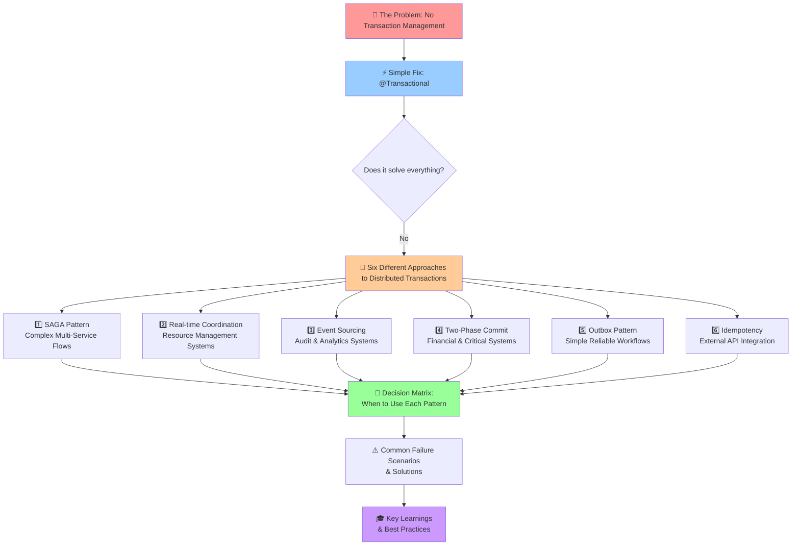

**What You'll Learn:**
- 🔍 Why simple solutions fail in distributed systems
- 🛠️ Six proven patterns for handling distributed transactions
- 🎯 When to use each pattern (with decision matrix)
- ⚠️ Real failure scenarios and how to handle them
- 🎓 Hard-earned lessons from production systems

---

## What Happens When You Ignore Transaction Management

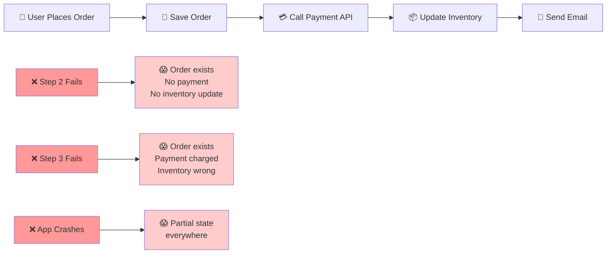

Let's start with a simple e-commerce checkout without any transaction handling:

```java
public void processOrder(OrderRequest request) {
    // Step 1: Save order
    Order order = new Order(request);
    orderRepository.save(order);
    
    // Step 2: Call payment API
    PaymentResponse payment = paymentAPI.charge(request.getAmount());
    
    // Step 3: Update inventory
    Product product = productRepository.findById(request.getProductId());
    product.decrementStock();
    productRepository.save(product);
    
    // Step 4: Send confirmation email
    emailService.sendOrderConfirmation(order);
}
```

**What goes wrong:**

1. **If Step 2 fails:** Order exists, no payment, inventory not updated
2. **If Step 3 fails:** Order exists, payment charged, inventory inconsistent
3. **If app crashes between steps:** Partial state everywhere
4. **If Step 4 fails:** Customer charged but no confirmation

**Real consequences:**
- Customers charged multiple times for failed orders
- Inventory showing wrong stock levels  
- Orders existing without payments
- Customer support nightmare

## Why @Transactional Helps... But Isn't Enough

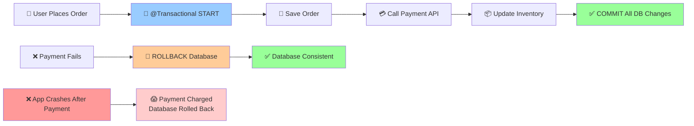

First attempt at fixing the problem - adding `@Transactional`:

```java
@Transactional
public void processOrder(OrderRequest request) {
    // Step 1: Save order
    Order order = new Order(request);
    orderRepository.save(order);
    
    // Step 2: Call payment API
    PaymentResponse payment = paymentAPI.charge(request.getAmount());
    
    // Step 3: Update inventory  
    Product product = productRepository.findById(request.getProductId());
    product.decrementStock();
    productRepository.save(product);
}
```

**What @Transactional fixes:**
- ✅ If Step 3 fails, Step 1 is automatically rolled back
- ✅ Database remains consistent
- ✅ No partial database state

**What @Transactional doesn't fix:**
- ❌ If app crashes after Step 2 (payment succeeded), database rollback happens but payment is still charged
- ❌ External API calls are outside transaction boundary
- ❌ No way to "undo" external system calls

**The core problem:** `@Transactional` only protects database operations. It can't rollback external API calls or handle application crashes between systems.

## Six Patterns for Distributed Transactions

When `@Transactional` isn't enough, you need other approaches. Here are six proven patterns that solve distributed consistency problems:

**The six patterns:**

### Pattern 1: Event-Driven SAGA Pattern

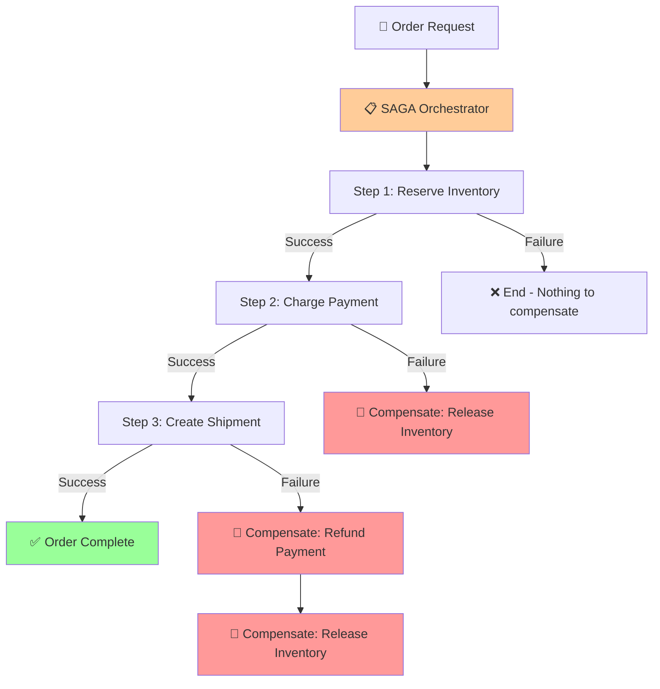

**Used in:** E-commerce platforms, booking systems, order processing

The idea: Break down operations into compensatable steps, each knowing how to undo itself.

```java
public class OrderProcessingSaga {
    
    public void processOrder(OrderRequest request) {
        SagaOrchestrator saga = new SagaOrchestrator();
        
        saga.addStep("RESERVE_INVENTORY",
            () -> inventoryService.reserve(request.getItems()),
            () -> inventoryService.release(request.getItems()));
            
        saga.addStep("CHARGE_PAYMENT", 
            () -> paymentService.charge(request.getTotal()),
            () -> paymentService.refund(request.getTotal()));
            
        saga.addStep("CREATE_SHIPMENT",
            () -> shippingService.createLabel(request),
            () -> shippingService.cancelShipment(request));
            
        saga.execute();
    }
}
```

**How it handles failures:**
- If payment fails after inventory reservation → inventory automatically released
- If shipment creation fails after payment → payment automatically refunded
- Each step can be retried or compensated independently

**Trade-offs:**
- ✅ Handles complex multi-service workflows
- ✅ Each service remains autonomous  
- ❌ Eventually consistent (temporary inconsistent states)
- ❌ Compensation logic can be complex

### Pattern 2: Real-Time Coordination (Uber/Lyft Style)

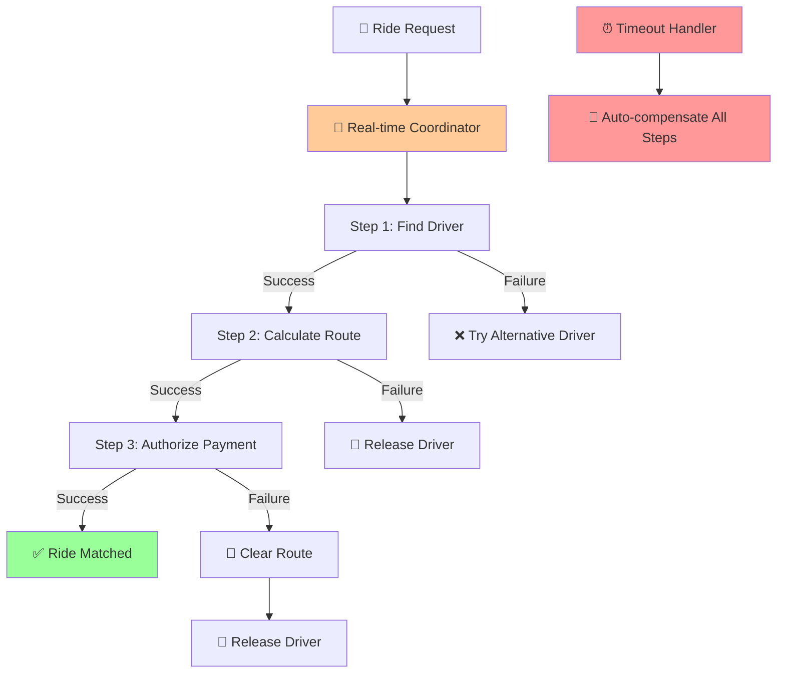

**Used in:** Real-time matching systems, resource allocation, dynamic pricing

The challenge: Multiple resources need to be coordinated in real-time with high availability.

```java
public class RideMatchingSaga {
    
    public void matchRide(RideRequest request) {
        List<CompensatableAction> steps = Arrays.asList(
            new CompensatableAction("FIND_DRIVER", 
                () -> driverService.assignNearestDriver(request),
                () -> driverService.releaseDriver(request.getDriverId())),
                
            new CompensatableAction("CALCULATE_ROUTE",
                () -> routeService.calculateOptimalRoute(request),
                () -> routeService.clearRoute(request.getRouteId())),
                
            new CompensatableAction("AUTHORIZE_PAYMENT",
                () -> paymentService.preAuthorize(request.getEstimatedCost()),
                () -> paymentService.cancelAuthorization(request.getAuthId()))
        );
        
        executeWithFailureHandling(steps);
    }
}
```

**Key insight:** If driver assignment succeeds but payment authorization fails, the system automatically releases the driver and can try alternative payment methods or drivers.

### Pattern 3: Event Sourcing (Netflix/Spotify Style)

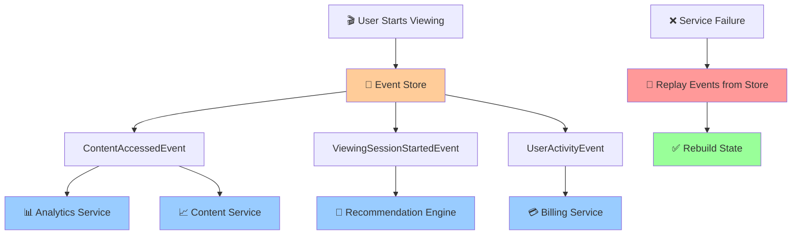

**Used in:** Streaming services, content delivery, user analytics

Instead of updating multiple services directly, publish immutable events that services can react to:

```java
public class ContentViewingManager {
    
    public void startViewing(ViewingRequest request) {
        List<DomainEvent> events = Arrays.asList(
            new ContentAccessedEvent(request.getUserId(), request.getContentId()),
            new ViewingSessionStartedEvent(request.getUserId(), request.getContentId()),
            new UserActivityEvent(request.getUserId(), "CONTENT_STARTED")
        );
        
        // Publish all events atomically
        eventStore.appendEvents(request.getSessionId(), events);
        
        // Services react asynchronously:
        // - Analytics service updates viewing stats
        // - Recommendation engine adjusts algorithms  
        // - Billing service tracks usage
        // - Content service updates popularity metrics
    }
}
```

**How failure recovery works:**
- If any service fails to process events, it can replay from the event store
- No complex compensation needed - services rebuild state from events
- Natural audit trail of all user actions

### Pattern 4: Two-Phase Commit (Banking Industry Standard)

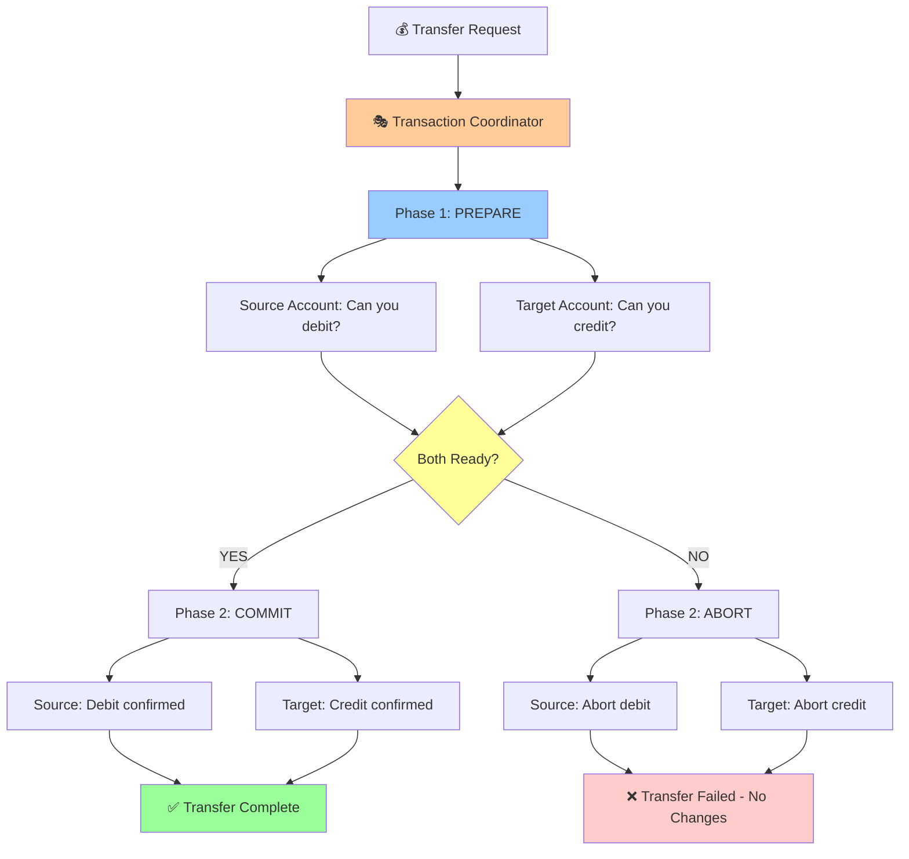

**Used in:** Financial transactions, critical data consistency, regulatory compliance

When you absolutely cannot afford inconsistency (like money transfers), use coordinated commitment:

```java
public class MoneyTransferCoordinator {
    
    public void transferFunds(TransferRequest request) {
        // Phase 1: PREPARE - Ask all parties if they can commit
        PrepareResponse sourceReady = sourceAccount.prepare(
            "DEBIT", request.getAmount()
        );
        
        PrepareResponse targetReady = targetAccount.prepare(
            "CREDIT", request.getAmount()
        );
        
        // Phase 2: COMMIT or ABORT based on all responses
        if (sourceReady.canCommit() && targetReady.canCommit()) {
            sourceAccount.commit();
            targetAccount.commit();
        } else {
            sourceAccount.abort();
            targetAccount.abort();
        }
    }
}
```

**Why banking systems work differently:**
- Money transfers happen in batches (NEFT/RTGS), not real-time
- Central coordinator (like RBI) manages inter-bank transactions  
- Shadow accounting tracks pending transfers
- Strict timeouts - if any party doesn't respond, transaction aborts

### Pattern 5: Outbox Pattern (Simple & Reliable)

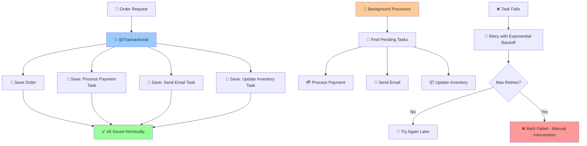

**Used in:** Simple workflows where full SAGA complexity isn't needed

Save both the main operation and "what to do next" in the same database transaction:

```java
@Transactional
public void processOrder(OrderRequest request) {
    // Save order and follow-up tasks atomically
    Order order = new Order(request);
    orderRepository.save(order);
    
    // Save tasks to be processed later
    outboxRepository.save(new OutboxEvent("PROCESS_PAYMENT", request.getPaymentData()));
    outboxRepository.save(new OutboxEvent("SEND_CONFIRMATION", order.getId()));
    outboxRepository.save(new OutboxEvent("UPDATE_INVENTORY", request.getItems()));
}

// Separate background processor handles outbox
@Scheduled(fixedDelay = 5000)
public void processOutboxEvents() {
    List<OutboxEvent> pending = outboxRepository.findPendingEvents();
    
    pending.forEach(event -> {
        try {
            switch (event.getType()) {
                case "PROCESS_PAYMENT":
                    paymentService.processPayment(event.getPayload());
                    break;
                case "SEND_CONFIRMATION":
                    emailService.sendConfirmation(event.getPayload());
                    break;
                case "UPDATE_INVENTORY":
                    inventoryService.updateStock(event.getPayload());
                    break;
            }
            event.markCompleted();
        } catch (Exception e) {
            event.incrementRetryCount();
            if (event.getRetryCount() > 3) {
                event.markFailed(); // Needs manual intervention
            }
        }
    });
}
```

**When Outbox works well:**
- Linear workflows (A → B → C)
- Acceptable eventual consistency  
- Simpler error handling requirements

### Pattern 6: Idempotency (API Industry Standard)

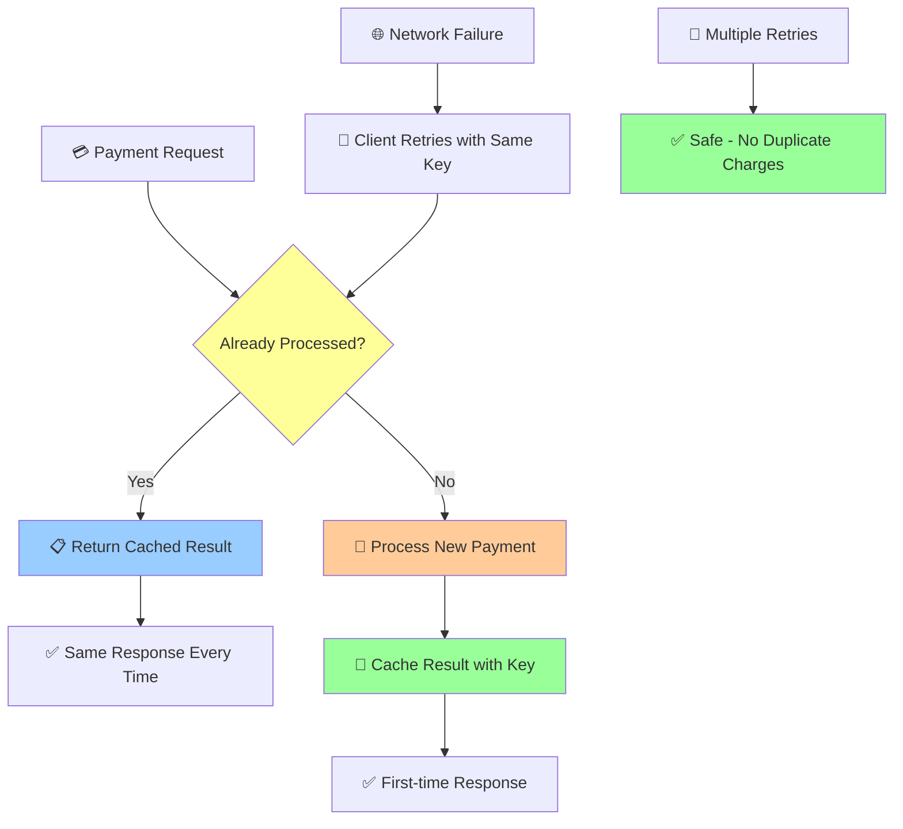

**Used in:** Payment processing, third-party integrations, unreliable networks

Make operations safely retryable instead of trying to coordinate failures:

```java
@PostMapping("/process-payment")
public ResponseEntity<PaymentResponse> processPayment(
    @RequestHeader("Idempotency-Key") String key,
    @RequestBody PaymentRequest request) {
    
    // Check if we already processed this exact request
    Optional<PaymentResponse> existingResult = paymentCache.findByKey(key);
    if (existingResult.isPresent()) {
        return ResponseEntity.ok(existingResult.get());
    }
    
    // Process new payment
    PaymentResponse response = executePayment(request);
    
    // Cache result for future retries
    paymentCache.store(key, response);
    
    return ResponseEntity.ok(response);
}
```

**Why this approach works:**
- Network failures are inevitable with external APIs
- Same operation can be safely retried multiple times
- Client-generated idempotency keys prevent duplicate charges
- Much simpler than complex distributed transaction coordination

## When Each Approach Makes Sense

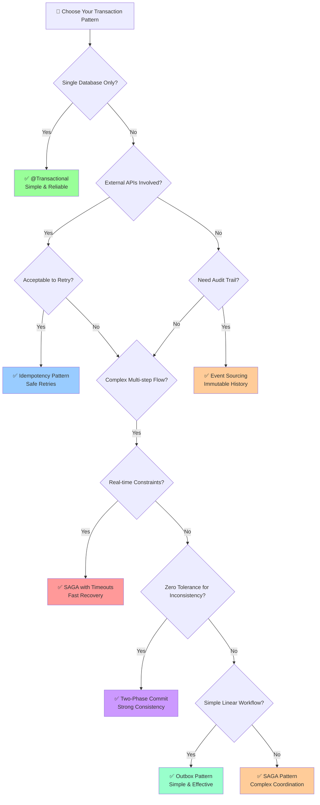

| **System Type** | **Pattern** | **Why** | **Trade-offs** |
|-----------------|-------------|---------|----------------|
| **Simple CRUD** | `@Transactional` | Single database, simple workflows | Strong consistency, limited to single DB |
| **E-commerce** | **SAGA** | Complex multi-service flows, compensation needed | Eventually consistent, complex debugging |
| **Real-time matching** | **SAGA with timeouts** | Resource coordination, high availability | Fast compensation, race conditions |
| **Content platforms** | **Event Sourcing** | Audit trails, multiple consumers | Eventual consistency, storage overhead |
| **Financial systems** | **Two-Phase Commit** | Regulatory compliance, zero tolerance for inconsistency | Lower availability, performance impact |
| **Simple workflows** | **Outbox Pattern** | Reliable async processing, simpler than SAGA | Eventual consistency, retry complexity |
| **External APIs** | **Idempotency** | Network failures, third-party reliability | Requires client cooperation, caching overhead |

## Performance and Complexity Considerations

**What happens when you choose the wrong pattern:**

**Using @Transactional for distributed workflows:**
```java
// This approach will fail in production
@Transactional
public void processCheckout(CheckoutRequest request) {
    orderRepository.save(order);           // ~10ms
    paymentAPI.chargeCustomer(request);    // ~2000ms - EXTERNAL API!
    emailService.sendConfirmation(order);  // ~500ms - EXTERNAL SMTP!
    // Total: ~2510ms user wait + transaction timeout risks
}
```

**Problems:**
- Database connection held for entire external API duration
- Transaction timeout if external services are slow
- No way to recover from partial failures
- Poor user experience (long wait times)

**Using SAGA when simpler patterns would work:**

```java
// Overkill for simple notification workflows
public class SimpleEmailSaga {
    public void sendWelcomeEmail(User user) {
        SagaOrchestrator saga = new SagaOrchestrator();
        saga.addStep("SAVE_USER", 
            () -> userRepository.save(user),
            () -> userRepository.delete(user));
        saga.addStep("SEND_EMAIL",
            () -> emailService.sendWelcome(user),
            () -> emailService.sendCancellation(user)); // Weird compensation!
        saga.execute();
    }
}
```

**Problems:**
- Complex infrastructure for simple workflow
- Unnatural compensation (sending cancellation email?)
- Over-engineering increases bugs and maintenance

## Common Failure Scenarios and Solutions

### 🔥 Scenario 1: Payment succeeded, order creation failed

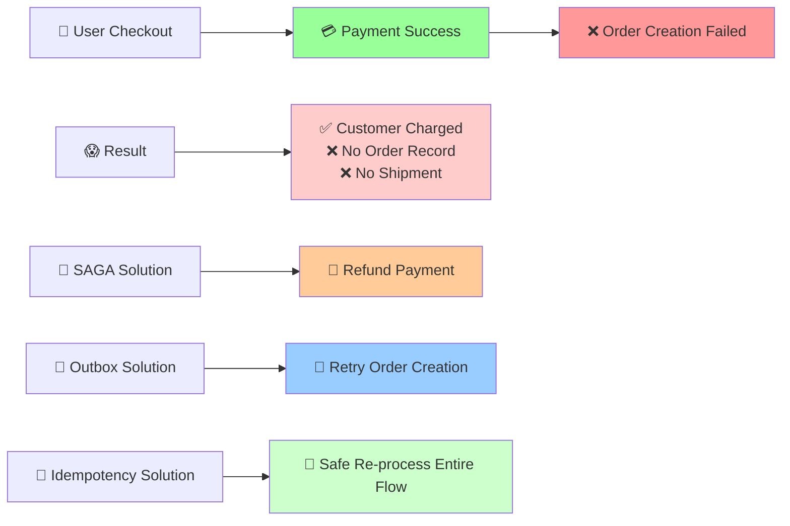

**Scenario 1: Payment succeeded, order creation failed**
```
✅ Customer charged
❌ No order record
❌ No shipment
```

**Solutions:**
- **SAGA:** Payment compensation (refund)
- **Outbox:** Retry order creation from payment success event
- **Idempotency:** Allow safe re-processing of the entire flow

### 🔥 Scenario 2: Multiple services down during checkout

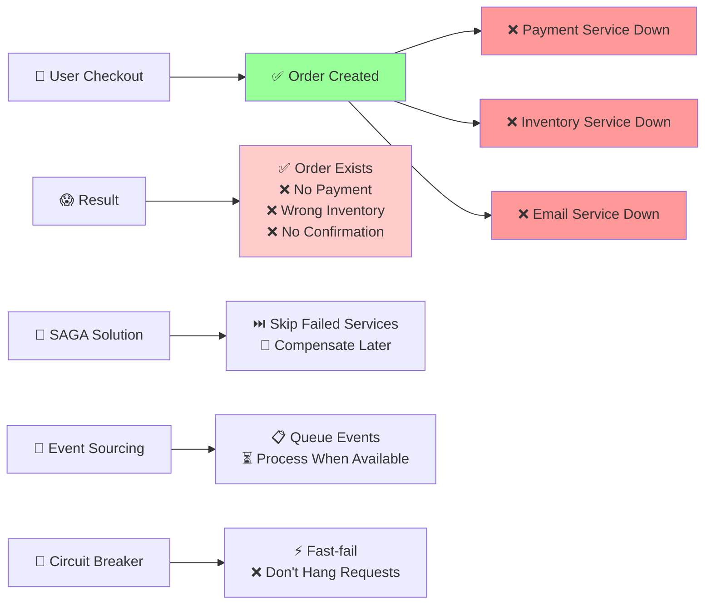

**Scenario 2: Multiple services down during checkout**
```
✅ Order created
❌ Payment service unavailable
❌ Inventory service unavailable  
❌ Email service unavailable
```

**Solutions:**
- **SAGA:** Skip failing services, compensate later
- **Event Sourcing:** Queue events, process when services recover
- **Circuit Breaker:** Fast-fail instead of hanging requests

### 🔥 Scenario 3: Partial network failure between services

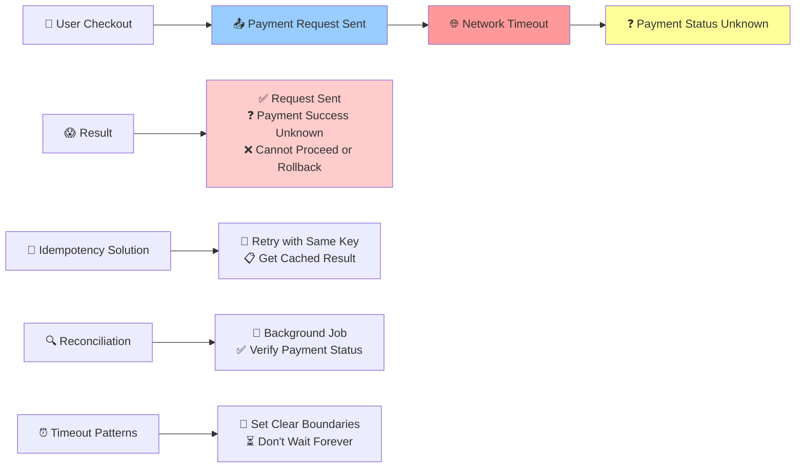

**Scenario 3: Partial network failure between services**
```
✅ Request sent to payment service
❓ Unknown if payment succeeded (network timeout)
❌ Cannot proceed or rollback safely
```

**Solutions:**
- **Idempotency:** Retry with same key, get cached result
- **Reconciliation:** Background job to verify payment status
- **Timeout patterns:** Set clear boundaries for waiting

## Key Learnings from Real-World Implementation

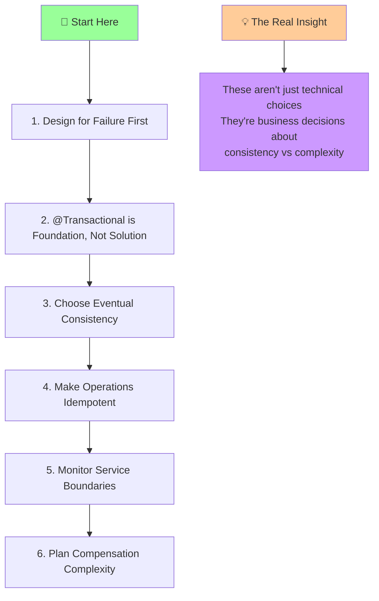

1. **Start with the failure cases, not the happy path** - most bugs happen when things go wrong, not when they go right.

2. **@Transactional is your foundation, not your complete solution** - it handles single-database consistency but can't coordinate external systems.

3. **Choose eventual consistency over complex coordination** - most business processes can tolerate short delays if it means better reliability.

4. **Make operations idempotent by default** - much easier than building complex failure recovery logic.

5. **Monitor the spaces between services** - traditional database monitoring won't catch distributed transaction failures.

6. **Plan for compensation complexity** - some operations (like sending emails) can't be meaningfully undone.

**The real insight:** These patterns aren't just technical choices - they're business decisions about what level of consistency and complexity your system actually needs.

---

## Your Experience

**How does your team handle distributed transactions?**

- **SAGA pattern:** What's your compensation strategy?
- **Outbox pattern:** How do you handle retries?  
- **Idempotency:** How do you generate keys?
- **Other approaches:** What works for your system?

**Have you faced similar failure scenarios?** Share your experience - real problems and solutions help everyone learn.

*Follow for more posts on distributed systems and microservices patterns.*

---

## Glossary

**Atomicity** — The "all or nothing" principle. Either every part of an operation succeeds, or none of it does.

**Transaction** — A group of database operations that succeed or fail together as a single unit.

**SAGA Pattern** — A way to manage long-running transactions across multiple services by defining compensation actions for each step.

**Outbox Pattern** — A technique where you save both your main data and "what to do next" in the same database transaction, then process the "what to do next" separately.

**Idempotency** — The ability to perform the same operation multiple times with the same result. Safe for retries.

**Compensation** — The reverse action that undoes a completed step when something fails later in the process.

**Distributed System** — An application made up of multiple services that need to work together reliably.
